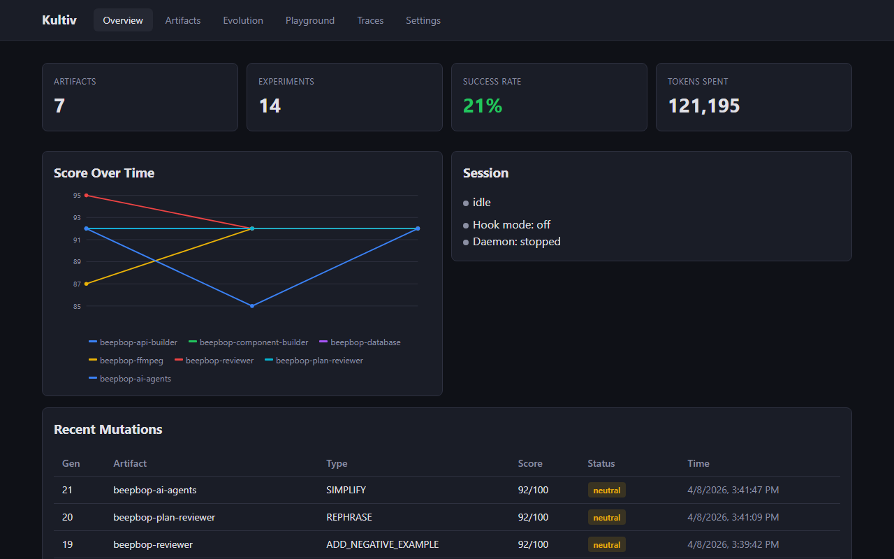

# Kultiv -- Cultivate Your Agents

> Your AI agents follow instructions. Kultiv rewrites those instructions,
> tests which version is better, and keeps the winners.
> Run it overnight. Wake up to smarter agents.

**Tweak -> Test -> Keep the best -> Repeat**




## What is Kultiv?

Kultiv is an open-source CLI tool that uses genetic algorithms to improve AI agent instructions automatically. Give it a prompt, tell it how to score quality, and it will tweak, test, and keep the best versions -- no manual editing required.

## Why Kultiv?

- **Manual prompt tuning doesn't scale.** You have 5 agents, each with 200-line instructions. Editing them by hand is slow and error-prone.
- **Small changes compound.** A 2% improvement per generation adds up. After 30 experiments, your agent prompt can go from 34% to 91%.
- **Your scoring criteria, not ours.** Use your own test suites, linters, or LLM judges. Kultiv scores against what matters to you.

## Get Started in 60 Seconds

```bash
npm install -g kultiv
cd your-project
kultiv init                       # creates .kultiv/ with config
kultiv add my-agent ./agents/my-agent.md
kultiv baseline                   # score the current version
kultiv evolve -n 10               # run 10 improvement experiments
```

## What Overnight Evolution Looks Like

**Before:**

```
my-agent: 34/100 (34%)
  FAIL typecheck: 10/30
  FAIL tests: 14/40
  PASS quality: 10/30
```

**After 30 experiments:**

```
my-agent: 91/100 (91%)
  PASS typecheck: 30/30
  PASS tests: 35/40
  PASS quality: 26/30
```

```
[##########---------] 15/30 experiments  |  12 kept  |  2 reverted  |  1 stuck
```

## How Kultiv Thinks

1. **Select parent** -- tournament selection with softmax roulette picks which artifact version to mutate next (not always the best -- exploration matters)
2. **Pick challenge** -- curriculum-based challenge selection targets the zone of proximal development (challenges the artifact is close to mastering)
3. **Mutate** -- 4-round dialogue engine (Explore → Critique → Specify → Generate) sees the rubric, per-criterion scores, and production failures
4. **Beam search** -- generate N variant mutations in parallel, score all of them, keep only the best
5. **Guard** -- semantic diff verifies the mutation only changed what the spec described (no scope creep)
6. **Score** -- run the full evaluator chain (compiler, test suite, linter, LLM judge) with per-criterion breakdowns
7. **Cross-validate** -- score against other challenges to detect overfitting to the current one
8. **Keep or revert** -- better score without regressions? Keep. Worse or overfitting? Revert automatically
9. **Learn** -- deterministic feedback detects anti-patterns; LLM reflection identifies what's working and adapts the strategy
10. **Report** -- when plateaued, generates improvement reports with per-criterion breakdown and next-tier requirements

## Features

### Evolution Engine
- **4-round dialogue mutations** -- Explore → Critique → Specify → Generate. The mutation LLM sees your rubric, per-criterion scores, and production failures
- **Beam search** -- generate N variant mutations per round, score all of them, keep the best. Configurable width (default 3)
- **Tournament selection** -- softmax roulette with diversity enforcement picks parents. Avoids always exploiting the current best
- **Curriculum challenges** -- challenge YAML files define scoring scenarios. Kultiv picks challenges in the zone of proximal development
- **Semantic diff guard** -- LLM verifies the mutation only changed what the spec described. Prevents scope creep and hallucinated rewrites
- **Cross-validation** -- after a mutation improves on one challenge, score against others to detect overfitting. Reverts if regressions found

### Scoring & Feedback
- **Calibrated scoring** -- graduated rubrics with 4-tier scoring ladders per criterion. Sum-based scoring (not holistic) prevents score inflation
- **9 mutation types** -- add rules, add examples, simplify, reorder, rephrase, merge, restructure, delete, add negative examples
- **Pattern guardrails** -- regex rules in `require` or `forbid` mode catch structural regressions instantly, zero LLM tokens
- **Tests that cost nothing** -- run your existing test suites, linters, and compilers as scorers
- **Deterministic feedback** -- anti-pattern detection (plateau, type fixation, bloat) runs every N iterations at zero token cost
- **LLM reflection** -- periodic meta-analysis of experiment history identifies what's working and suggests strategy changes

### Self-Improvement
- **Knows when it's stuck** -- detects plateaus and generates improvement reports with per-criterion breakdown and next-tier requirements
- **Improves how it improves** -- outer loop rewrites the mutation strategy. Dialogue mode uses 3-round revision with mini-batch validation
- **Diagnostic mutations** -- feeds real production failures from `.kultiv/pending/` into the mutation engine

### Operations
- **Agent scanning** -- `kultiv scan` analyzes any prompt for purpose, structure, and improvement opportunities
- **Insights dashboard** -- built-in web dashboard shows scores, beam search results, challenge badges, cross-validation, and mutation history
- **Runs while you sleep** -- hook into Claude Code post-session events or schedule via cron/Task Scheduler
- **Works with Anthropic, OpenAI, Ollama, Claude Code** -- bring your own provider and model

## CLI Reference

| Command | What it does |
|---------|-------------|
| `kultiv init` | Create `.kultiv/` directory with config and empty archive |
| `kultiv add <name> <path>` | Register an artifact to evolve |
| `kultiv baseline` | Score artifacts without changing them |
| `kultiv run` | Run a single mutation experiment |
| `kultiv evolve -n <N>` | Run N experiments in a session |
| `kultiv status` | Show scores, mutation counts, anti-patterns |
| `kultiv history` | Show experiment archive (most recent first) |
| `kultiv trace "<cmd>"` | Wrap a shell command as a traced run |
| `kultiv pause` | Pause the current evolution session |
| `kultiv resume` | Resume a paused session |
| `kultiv daemon start` | Start the background automation daemon |
| `kultiv daemon stop` | Stop the daemon |
| `kultiv scan` | Analyze agent prompts for purpose, structure, and recommendations |
| `kultiv dashboard` | Open the web dashboard at localhost:4200 |

All commands accept `-c, --config <path>` to use a custom config file (defaults to `.kultiv/config.yaml`).

### Agent Scanning

Scan any agent prompt to understand its purpose, structure, and where it can be improved:

```bash
kultiv scan --artifact my-agent     # scan a registered artifact
kultiv scan --file ./prompts/qa.md  # scan any file directly
kultiv scan                         # scan all registered artifacts
```

The scan produces a structural analysis with:
- **Purpose and domain** -- what the agent is designed to do
- **Section breakdown** -- each section with line count and quality assessment
- **Recommendations** -- trim, expand, combine, split, restructure, or add examples (with priority)
- **Feature flags** -- whether the prompt includes examples, negative examples, and decision trees

Scan results are saved to `.kultiv/scans/` and automatically fed into the mutation engine during evolution.

### Dashboard Documentation Panel

The web dashboard includes a built-in documentation panel. Click the **Docs** button in the top-right corner of the header to open a slide-out panel with searchable documentation covering Quick Start, Mutation Types, Scoring, Evolution, Configuration, CLI Reference, Dashboard Guide, and Workflows. Press Escape or click outside to close.

### Diagnostic Mutations

When your agents fail in production, capture those failures in `.kultiv/pending/` (the hook pipeline does this automatically). During evolution, kultiv loads the 5 most recent failures for each artifact and includes them in the mutation context. The mutation LLM sees exactly what went wrong and proposes fixes that target real problems.

## Configuration

Kultiv stores all state in a `.kultiv/` directory at your project root. The main config file is `.kultiv/config.yaml`.

```yaml
version: "1.0"

# What to evolve -- register with `kultiv add <name> <path>`
artifacts:
  my-agent:
    path: ./agents/my-agent.md       # path to the artifact file
    type: prompt                     # prompt | config | template | doc
    scorer:
      chain:
        - name: typecheck            # human-readable name
          command: "npx tsc --noEmit" # shell command to run
          type: script               # script | pattern | llm-judge
          weight: 3                  # higher = more important
        - name: tests
          command: "npx vitest run"
          type: script
          weight: 2
        - name: quality
          type: llm-judge            # uses configured LLM
          rules_file: .kultiv/judge-rules.md
          weight: 1

# Which LLM to use for mutations
llm:
  provider: anthropic                # anthropic | openai | ollama | claude-code
  model: claude-sonnet-4-20250514
  auth_env: ANTHROPIC_API_KEY        # env var holding your key

# How many experiments to run
evolution:
  budget_per_session: 10             # max mutations per session
  feedback_interval: 3               # check for anti-patterns every 3 runs
  outer_interval: 10                 # revise mutation strategy every 10 runs
  plateau_window: 5                  # detect plateaus over 5-run windows
  mutation_mode: dialogue            # dialogue (4-round) or single (1-shot)
  beam_width: 3                      # generate N variants per mutation, keep best
  cross_validation_count: 2          # score against N other challenges after success
  selection:
    parent_method: tournament        # tournament (explore) or greedy (exploit)
    parent_temperature: 1.2          # higher = more exploration (softmax temp)
    challenge_method: curriculum     # curriculum | min_score | round_robin

# Feedback loops
feedback:
  deterministic_interval: 3          # anti-pattern check every N iterations
  llm_reflection_interval: 10        # LLM meta-analysis every N iterations
  llm_reflection_enabled: true       # enable/disable LLM reflection

# Outer loop (meta-strategy revision)
outer_loop:
  mode: dialogue                     # dialogue (3-round) or single (1-shot)
  validation_batch_size: 2           # score N artifacts to validate strategy changes

# Unattended evolution
automation:
  hook_mode: false                   # trigger from Claude Code hooks
  daemon_mode: false                 # run on a cron schedule
  daemon_schedule: "*/30 * * * *"    # every 30 minutes
  cooldown_minutes: 10               # minimum gap between sessions
  auto_commit: true                  # git commit improvements
  auto_push: false                   # manual push (safety default)
  max_regressions_before_pause: 3    # stop after 3 bad results

# Web dashboard
dashboard:
  port: 4200
  open_browser: true

# Self-improving mutation strategy
meta_strategy_path: .kultiv/meta-strategy.md
```

## Scoring System

Kultiv scores artifacts using a chain of evaluators. Each one runs independently and contributes a weighted score.

**Command scorers** (`type: script`) -- run a shell command, derive score from exit code/output. Deterministic, zero tokens.

```yaml
- name: typecheck
  command: "npx tsc --noEmit"
  type: script
  weight: 3
```

**Pattern scorers** (`type: pattern`) -- regex rules against artifact content. Two modes:
- `forbid` (default) -- penalize when a pattern IS found (e.g., banning `any` types)
- `require` -- penalize when a pattern is NOT found (e.g., requiring auth checks)

```yaml
- name: structure
  type: pattern
  rules_file: .kultiv/pattern-rules.json
  weight: 1
```

```json
{
  "rules": [
    { "pattern": "getUser", "message": "Must include auth check", "severity": "error", "mode": "require" },
    { "pattern": "select\\('\\*'\\)", "message": "Avoid select('*')", "severity": "warning", "mode": "forbid" }
  ]
}
```

**LLM judges** (`type: llm-judge`) -- send artifact to the LLM with a graduated rubric. Each criterion has a 4-tier scoring ladder (Minimal → Adequate → Good → Excellent). Scores are summed per-criterion, not judged holistically, preventing score inflation.

```yaml
- name: quality
  type: llm-judge
  rules_file: .kultiv/judge-rubric.md
  weight: 1
```

**Total score** = weighted sum across all evaluators, normalized to 100. Per-criterion breakdowns are stored in the archive and shown in the dashboard.

## Mutation Types

| Type | What it does | When to use |
|------|-------------|-------------|
| `ADD_RULE` | Add a new instruction | Test failed because a behavior is missing |
| `ADD_EXAMPLE` | Add a "do this" example | Rule exists but agent misapplies it |
| `ADD_NEGATIVE_EXAMPLE` | Add a "don't do this" example | Same mistake keeps happening |
| `REORDER` | Move a section up or down | Important rule is buried too deep |
| `SIMPLIFY` | Remove redundant content | Artifact is bloated with low improvement |
| `REPHRASE` | Rewrite for clarity | Scores fluctuate on the same content |
| `DELETE_RULE` | Remove a rule | Rule consistently makes things worse |
| `MERGE_RULES` | Combine related rules | Several scattered rules cover the same topic |
| `RESTRUCTURE` | Reorganize the whole artifact | Related content is too far apart |

Kultiv picks mutation types based on the meta-strategy and recent results. It avoids repeating the same type twice in a row and forces structural mutations after 3 consecutive additions.

## LLM Providers

### Anthropic

```yaml
llm:
  provider: anthropic
  model: claude-sonnet-4-20250514
  auth_env: ANTHROPIC_API_KEY
```

```bash
export ANTHROPIC_API_KEY=sk-ant-...
```

### OpenAI

```yaml
llm:
  provider: openai
  model: gpt-4o
  auth_env: OPENAI_API_KEY
```

```bash
export OPENAI_API_KEY=sk-...
```

### Ollama (local, free)

```yaml
llm:
  provider: ollama
  model: llama3
```

```bash
ollama serve && ollama pull llama3
```

### Claude Code CLI

```yaml
llm:
  provider: claude-code
  model: claude-sonnet-4-20250514
```

Uses your existing Claude Code subscription. No separate key needed.

## Automation

Kultiv can run unattended in two modes.

### Hook mode

Integrates with Claude Code post-session hooks. After each coding session, a pending file drops into `.kultiv/pending/`. On the next `kultiv evolve` or daemon tick, pending items get processed.

```yaml
automation:
  hook_mode: true
  trigger_after: 1
  cooldown_minutes: 10
```

### Daemon mode

Runs in the background on a cron schedule. Checks for pending work, evolves, and respects cooldown and regression limits.

```yaml
automation:
  daemon_mode: true
  daemon_schedule: "*/30 * * * *"
  auto_commit: true
  max_regressions_before_pause: 3
```

```bash
kultiv daemon start
kultiv daemon stop
```

The daemon writes a PID to `.kultiv/daemon.pid` and uses `.kultiv/lock` to prevent overlapping sessions.

### Safety controls

- Cooldown timer prevents running too frequently
- Regression limit pauses after N bad results
- Lockfile prevents overlapping sessions
- `auto_push` defaults to false -- you always review before pushing

## Presets

Start with a config tuned for your stack:

```bash
kultiv init --preset nextjs
```

| Preset | Evaluators | Best for |
|--------|-----------|----------|
| `standard` | Placeholder scorer | Any project (default) |
| `nextjs` | tsc, eslint, next build | Next.js apps |
| `typescript` | tsc, eslint, vitest | TypeScript libraries |
| `python` | mypy, pytest, ruff | Python projects |
| `go` | go vet, go test, golangci-lint | Go projects |
| `rust` | cargo check, cargo test, clippy | Rust projects |

## Architecture

```
src/
  core/           config (Zod-validated), archive (JSONL + per-criterion checks), artifact reader, trace store
  scoring/        chain runner, command scorer, pattern scorer (require/forbid), LLM judge, cross-validator
  mutation/       4-round dialogue engine (beam search), single-call fallback, agent scanner, apply/revert
  selection/      tournament parent selection (softmax + diversity), curriculum challenge selection
  challenges/     challenge YAML loader, LLM-powered challenge generator
  guards/         semantic diff guard (LLM-verified mutation scope)
  detection/      plateau + anti-pattern heuristics (zero LLM tokens)
  loops/          inner loop (select→mutate→guard→score→validate), outer loop (dialogue mode), feedback
  automation/     cron daemon, hook trigger, pending queue, lockfile
  llm/            Anthropic (streaming), OpenAI, Ollama, Claude Code adapters
  safety/         git branch-per-experiment, auto-merge, auto-abandon
  dashboard/      Preact SPA with beam search display, challenge badges, cross-validation, built-in docs

bin/
  kultiv.ts       CLI entry point (Commander.js)

templates/
  config.template.yaml       default config
  meta-strategy.template.md  default mutation strategy
```

### Data flow

```
Tournament Select Parent  -->  Curriculum Select Challenge
         |                              |
         v                              v
4-round dialogue (rubric + weak criteria + failures + scan)
         |
         v
Beam Search: generate N variants  -->  Score all  -->  Pick best
         |
         v
Semantic Diff Guard (verify scope)  -->  FAIL? → revert
         |
         v
Size Guard (±50% limit)  -->  FAIL? → revert
         |
         v
Apply best variant  -->  Re-score  -->  Compare to baseline
         |                                      |
         v                                      v
Cross-validate (other challenges)        WORSE? → revert
         |
         v
REGRESSED on others? → demote to neutral & revert
         |
         v
Archive entry  -->  Deterministic feedback  -->  LLM reflection
                            |                          |
                            v                          v
                    Anti-pattern alerts         Strategy insights
                            |
                            v
                    Outer loop (dialogue mode + mini-batch validation)
                            |
                            v
                    Improvement report (if plateaued)
```

## Contributing

```bash
git clone https://github.com/ronslicker0/kultiv.git
cd kultiv
npm install
npm run build
npm test
```

1. Create a branch for your feature or fix
2. Write tests (`vitest`)
3. Ensure `npm run build && npm run lint && npm test` passes
4. Submit a pull request

**Good first contributions:** new LLM adapters (`src/llm/`), new mutation types, new evaluator types, presets for more languages, dashboard improvements.

## License

MIT -- see [LICENSE](LICENSE) for details.
